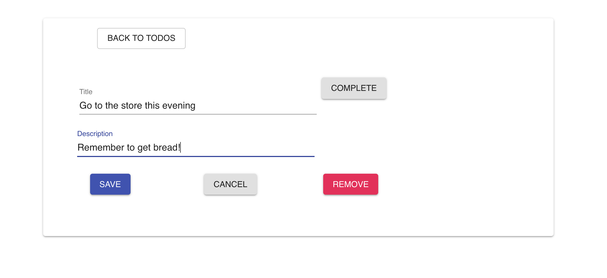

#React-Redux-Todos
This application allows for users to enter todos and edit, complete, or delete those todos. The technologu used includes React, Redux, Redux-saga, and Material UI for the design.

##Screenshots



##Installation
``` 
git clone https://github.com/craigwendel/react-redux-todos.git 
cd react-redux-todos 
yarn install 
yarn start

open localhost:3000 in the browser

```

##License
This project is licensed under the MIT License.